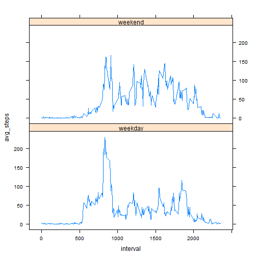

# Reproducible Research: Peer Assessment 1

## Loading and preprocessing the data
The repository already has the dataset, we just unzip it and read as cvs:

```r
data <- read.csv(unz("activity.zip", "activity.csv"), header=TRUE, quote="\"", sep=",")
dim(data)
```

```
## [1] 17568     3
```

```r
head(data)
```

```
##   steps       date interval
## 1    NA 2012-10-01        0
## 2    NA 2012-10-01        5
## 3    NA 2012-10-01       10
## 4    NA 2012-10-01       15
## 5    NA 2012-10-01       20
## 6    NA 2012-10-01       25
```

```r
summary(data)
```

```
##      steps                date          interval     
##  Min.   :  0.00   2012-10-01:  288   Min.   :   0.0  
##  1st Qu.:  0.00   2012-10-02:  288   1st Qu.: 588.8  
##  Median :  0.00   2012-10-03:  288   Median :1177.5  
##  Mean   : 37.38   2012-10-04:  288   Mean   :1177.5  
##  3rd Qu.: 12.00   2012-10-05:  288   3rd Qu.:1766.2  
##  Max.   :806.00   2012-10-06:  288   Max.   :2355.0  
##  NA's   :2304     (Other)   :15840
```

Use dplyr package for data manipulation

```r
library(dplyr)
```
Load data into a table frame: 

```r
activity_tf <- tbl_df(data)
```

## What is mean total number of steps taken per day?

- Calculate the total number of steps taken per day
Group the data by day:

```r
by_day<-group_by(activity_tf,date)
```
Use mutate to add *totals* column.
For this part of the assignment, we ignore the missing values in the dataset by using *na.rm =TRUE* with functions like *sum* and *mean*.

```r
total_steps <- mutate(by_day, totals=sum(steps, na.rm =TRUE))
```

- Make a histogram of the total number of steps taken each day


```r
hist(as.numeric(total_steps$totals), main="", xlab="Total number of steps per day")
```

 

- Calculate and report the mean and median of the total number of steps taken per day

```r
t_mean <- mean(as.numeric(total_steps$totals), na.rm = TRUE)
t_mean
```

```
## [1] 9354.23
```

```r
t_median <- median(as.numeric(total_steps$totals), na.rm = TRUE)
t_median
```

```
## [1] 10395
```
Thus, for the total number of steps taken per day the mean is 9354.23 and the median is 10395.00.

## What is the average daily activity pattern?

- Make a time series plot (i.e. type = "l") of the 5-minute interval (x-axis) and the average number of steps taken, averaged across all days (y-axis)

First group the data by 5-minute interval and add a new variable for the average number of steps taken across all days.


```r
by_interval<-group_by(activity_tf,interval)
average_steps <- mutate(by_interval, avg_steps=mean(steps, na.rm = TRUE))
```
Make a time series plot

```r
with(average_steps, plot(interval, avg_steps, type="l", ylab="Average number of steps", xlab="5-minute interval"))
```

 

- Find 5-minute interval that contains the maximum number of steps?

```r
max_nos <- max(average_steps$avg_steps, na.rm = TRUE)
neededrows<- filter(average_steps, avg_steps==max_nos)
needed_interval <- neededrows$interval
needed_interval[[1]]
```

```
## [1] 835
```
Thus, 835 is the 5-minute interval, on average across all the days in the dataset, that contains the maximum number of steps (206).

## Imputing missing values

- Calculate and report the total number of missing values in the dataset (i.e. the total number of rows with NAs)

Namely, find the number of rows where at least one column value is missing:

```r
rows_without_missing_values <-filter(activity_tf,  (is.na(steps) | is.na(date) | is.na(interval) ) )
dim(rows_without_missing_values)[[1]]
```

```
## [1] 2304
```

Thus, there are 2304 rows in the dataset with at least one missing column value.

- Devise a strategy for filling in all of the missing values in the dataset.

Since we don't have any rows with either missing dates or missing intervals,

```r
rows_without_missing_dates <-filter(activity_tf, is.na(date) )
dim(rows_without_missing_dates)[[1]]
```

```
## [1] 0
```

```r
rows_without_missing_intervals <-filter(activity_tf, is.na(date) )
dim(rows_without_missing_intervals)[[1]]
```

```
## [1] 0
```
we can group data by interval and calculate average values for steps per interval, namely we can reuse the data frame *average_steps*. The value from the *avg_steps* column will replace missing values in the steps column.

```r
head(average_steps)
```

```
## Source: local data frame [6 x 4]
## Groups: interval
## 
##   steps       date interval avg_steps
## 1    NA 2012-10-01        0 1.7169811
## 2    NA 2012-10-01        5 0.3396226
## 3    NA 2012-10-01       10 0.1320755
## 4    NA 2012-10-01       15 0.1509434
## 5    NA 2012-10-01       20 0.0754717
## 6    NA 2012-10-01       25 2.0943396
```
 
- Create a new dataset that is equal to the original dataset but with the missing data filled in.

```r
average_steps$steps[is.na(average_steps$steps)] <- average_steps$avg_steps[is.na(average_steps$steps)]
new_dataset <- select(average_steps, c(steps, date, interval))
head(new_dataset)
```

```
## Source: local data frame [6 x 3]
## Groups: interval
## 
##       steps       date interval
## 1 1.7169811 2012-10-01        0
## 2 0.3396226 2012-10-01        5
## 3 0.1320755 2012-10-01       10
## 4 0.1509434 2012-10-01       15
## 5 0.0754717 2012-10-01       20
## 6 2.0943396 2012-10-01       25
```

```r
dim(new_dataset)
```

```
## [1] 17568     3
```


- Make a histogram of the total number of steps taken each day and Calculate and report the mean and median total number of steps taken per day. Do these values differ from the estimates from the first part of the assignment? What is the impact of imputing missing data on the estimates of the total daily number of steps?

Group the data by day and make a histogram of the total number of steps taken each day

```r
by_day<-group_by(new_dataset,date)
total_steps <- mutate(by_day, totals=sum(steps))
hist(as.numeric(total_steps$totals), main="", xlab="Total number of steps per day")
```

 

Calculate and report the mean and median of the total number of steps taken per day

```r
t_mean <- mean(as.numeric(total_steps$totals), na.rm = TRUE)
t_mean
```

```
## [1] 10766.19
```

```r
t_median <- median(as.numeric(total_steps$totals), na.rm = TRUE)
t_median
```

```
## [1] 10766.19
```
Thus, for the total number of steps taken per day the mean is 10766.19 and the median is 10766.19.

These values differ from the first part of the assignment. Thus, the presence of missing days introduced bias into summaries of the data.


## Are there differences in activity patterns between weekdays and weekends?

- Create a new factor variable in the dataset with two levels - "weekday" and "weekend" indicating whether a given date is a weekday or weekend day.


```r
with_factor<-mutate(new_dataset, daytype=factor(1*(weekdays(as.POSIXct(date, format="%Y-%m-%d")) %in% c("Saturday","Sunday")) , labels=c("weekday","weekend") ) )
head(with_factor)
```

```
## Source: local data frame [6 x 4]
## Groups: interval
## 
##       steps       date interval daytype
## 1 1.7169811 2012-10-01        0 weekday
## 2 0.3396226 2012-10-01        5 weekday
## 3 0.1320755 2012-10-01       10 weekday
## 4 0.1509434 2012-10-01       15 weekday
## 5 0.0754717 2012-10-01       20 weekday
## 6 2.0943396 2012-10-01       25 weekday
```
- Make a panel plot containing a time series plot (i.e. type = "l") of the 5-minute interval (x-axis) and the average number of steps taken, averaged across all weekday days or weekend days (y-axis).

Group new data by *daytype* and by *interval* and calculate average for *steps*.


```r
avg_per_daytype <- with(with_factor, aggregate(steps, by=list(daytype, interval), FUN=mean))
names(avg_per_daytype) <- c("daytype", "interval", "avg_steps")
```
Now make time series plots using the lattice system

```r
library("lattice")
```


```r
xyplot(avg_steps ~ interval | daytype, data = avg_per_daytype, type = "l", layout = c(1,2))
```

 


